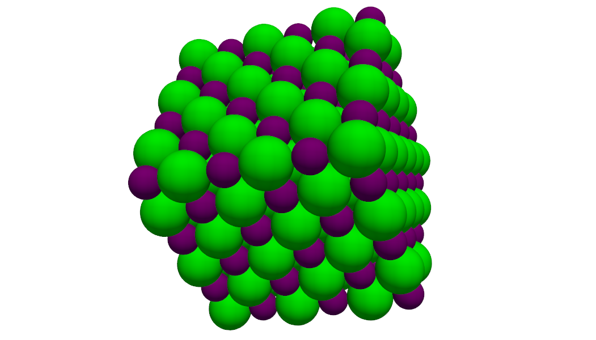
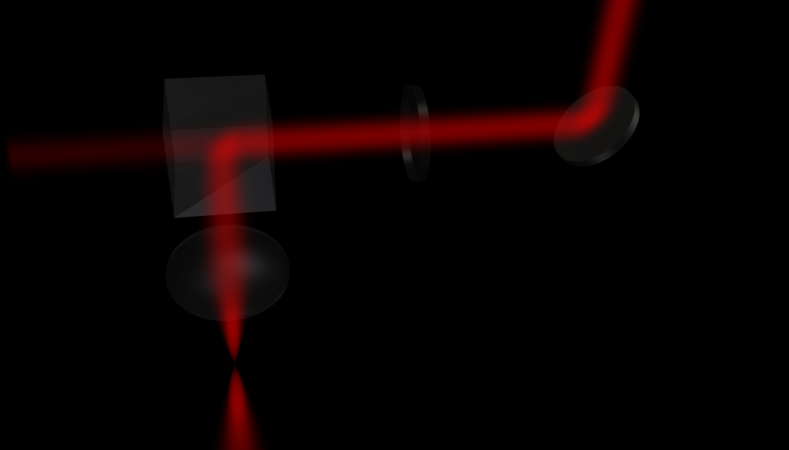

# Phyvista

## Purpose

Phyvista is a python library built as an extension to pyvista specifically for the creation of 3D illustrations for physics. As such, it provides useful functions to make the process fast and easy.

## Requirements

As of now, phyvista requires a recent version of pyvista and numpy. It is possible that some specific submodules may have higher requirements.

## Code organization

One requirement is for this library to work seamlessly with pyvista, so that it is simple for the user to use pyvista functions when PHYvista doesn't provides what they want.

The "core" and "material" python files provides functionnality used my most of the other, more specific files.

### Submodules

#### General-purpose

- core.py : add the 'add' method to pyvista.Plotter, and creates classes Element and Group
- materials.py : creates class Material, and provide some template materials as instances
- constructors.py : defines additionnal functions for creating pyvista grids of commonly used shapes
- colors.py : provides useful color-related functions

#### Specific
- lattices.py : repeating patterns & crystals
- optics.py : optical elements such as lenses
- light.py : laser beams, "fluorescent" points

#### Example images
Scene from running the example 'example_lattices.py' :

Scene from running the example 'example_optics.py' (with global theme 'dark' and 'semirealistic' beam style) :

